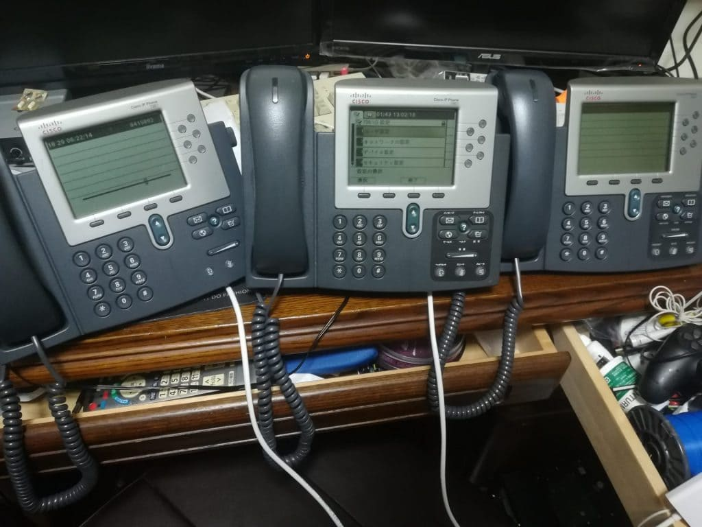
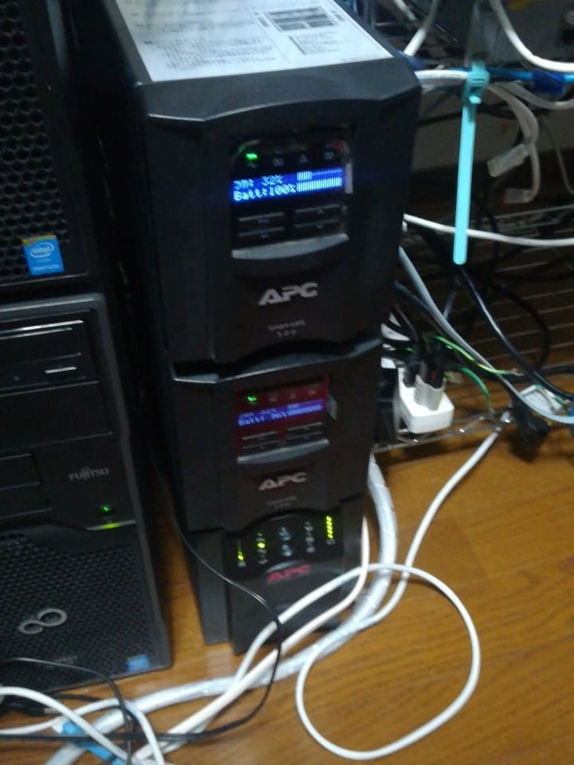
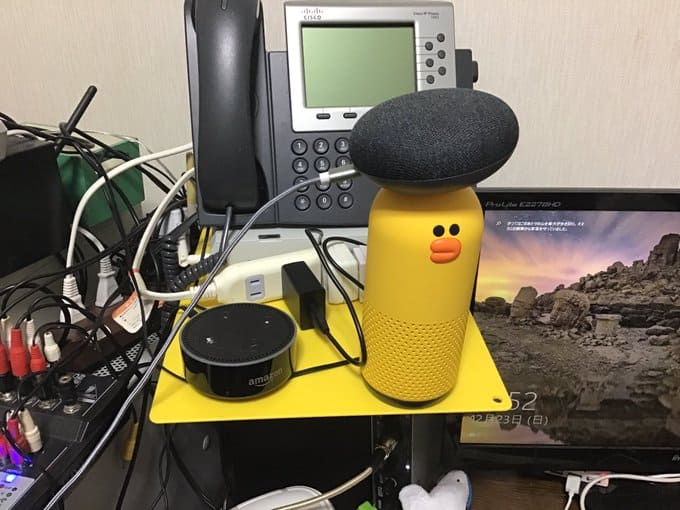

サーバー機器は[こちら](https://yoneyannet.com/2019%E5%B9%B4%E5%BA%A68%E6%9C%88%E8%87%AA%E5%AE%85%E3%82%B5%E3%83%BC%E3%83%90%E3%83%BC%E3%81%AE%E7%B4%B9%E4%BB%8B/)で紹介しています。

ネットワーク機器は多すぎるので[別記事](https://yoneyannet.com/2019%E5%B9%B4%E5%BA%A68%E6%9C%88%E8%87%AA%E5%AE%85%E3%83%8D%E3%83%83%E3%83%88%E3%83%AF%E3%83%BC%E3%82%AF%E6%A9%9F%E5%99%A8%E3%81%AE%E7%B4%B9%E4%BB%8B/)にしています。

### IP電話

Cisco IP Phone 3兄弟

*   Cisco IP Phone 7961 x2
*   Cisco IP Phone 7962
*   Cisco IP Phone 7941G x2
*   Cisco IP Phone 6921
*   メーカ＆型番忘れたIP電話 x3

### UPS

UPS3台（部屋移動前）

*   Smart-UPS 500 LCD x2
*   Smart-UPS 500

この3台のUPSの内2台がバッテリーが死んでしまっているので停電すると終わります^^;

*写真自体は部屋移動前のものです。移動してからの写真がなかったので今月中には更新します。

### LTOドライブ

https://www.youtube.com/watch?v=spdsu90GAss

ETERNUS LT20(HPのOEM)

*   ETERNUS LT20

1UのLTOドライブです。最大でLTOカートリッジが8台入ります。

LTOドライブの規格はLTO4です。

Mini-SASケーブルがないので、バックアップできない状態です。

そのケーブルは中古でもそこそこするので、有り余っている方で譲っていただける場合はメールまでお願いします。

### スマートスピーカ

スマートスピーカはどこの家にもあると思いますが、紹介します。

*   Google Home Mini x2
*   Google Home （親分サイズ）
*   Alexa Mini
*   Alexa （親分サイズ）
*   LINE Clova

まとめ
---

自宅はこのようになっています。

みなさんは、このような状況にならないようにご注意ください＼(^o^)／

サーバーラックは持ってないけど、自宅ラックは最高だぜーー