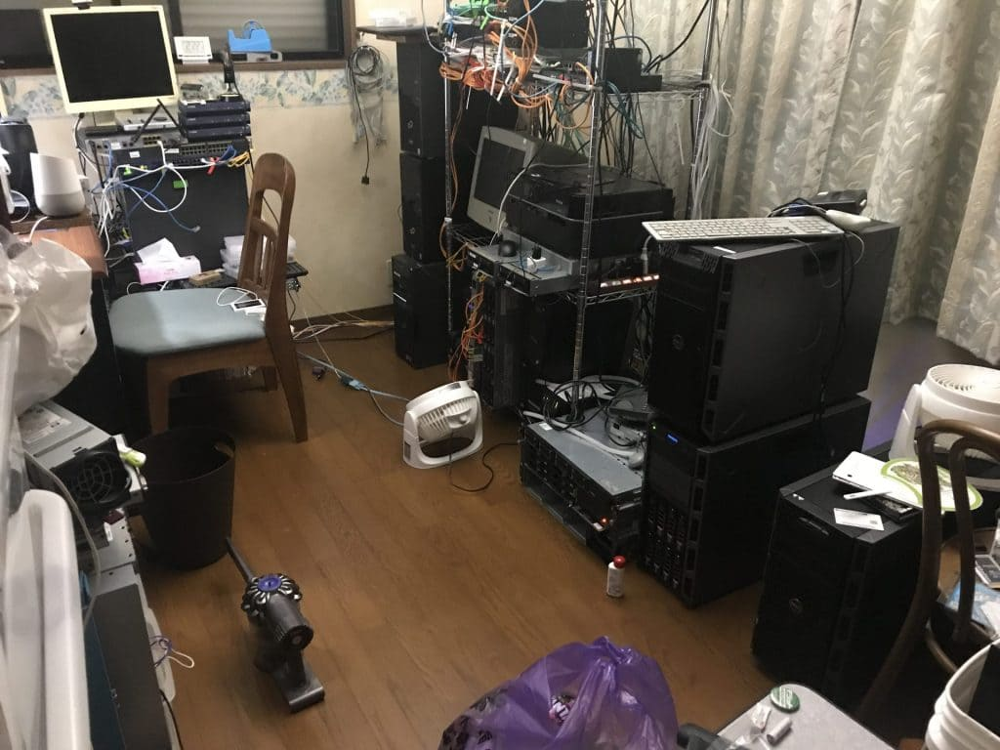
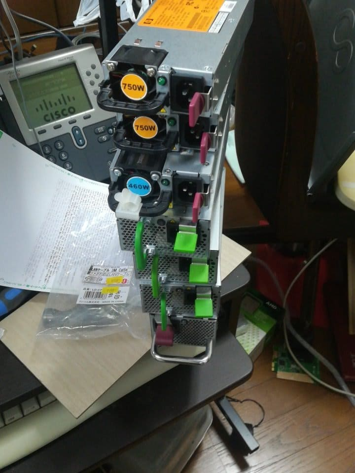

サーバーの紹介
-------

ネットワーク機器は多すぎるので[別記事](https://yoneyannet.com/2019年度8月自宅ネットワーク機器の紹介/)にしています。

また、サーバーやネットワークに属さない機器は[こちら](https://yoneyannet.com/2019年度8月自宅その他機器の紹介/)で紹介しています。

#### 運用中

*   Fujitsu TX1310 M1 ---Windows Server 2019 Standard (AD,RDP)
*   Fujitsu TX100 S3 ----FiberChannel検証用
*   Fujitsu CELSIUS W510 ----録画サーバー(Win10 Pro)
*   Fujitsu TX100 S3 ----鯖部屋クライアントPC(Win10 Pro)
*   Dell T320 ----メインサーバー1(CentOS7) *2
*   Dell T320 ----メインサーバー2(CentOS7)(*運用予定) *3
*   Dell T420 ----貸出用(未完成) *4

機種

CPU

RAM

DISK

その他

TX1310 M1

Pentium G3240

6G

120G(SSD)+160Gx2+700Gx2

TX100 S3

謎

2G

iscsi boot

CELSIUS W510

Xeon E3-1225

4G

64G(SSD)+320Gx2

エンコード用 RX470

TX100 S3

Xeon E3-1280

6G

64G(SSD)

AD管理

T320

E5-2450L

20G

120G(SSD)x2+1TBx6

メインサーバー

T320

E5-2450L

2G

\-\-\-\-

構築予定

T420

E5-2450L

64G

1TBx2

*1 家にADを構築したいと思ったので構築しました

*2 主にPXEブート、iscsiブート、KVMによる仮想化を提供しています。アクセスが多いということもあり、スイッチには10Gで接続しています。

*3 まだ、構築が終わっていないサーバーです。完成時にはメインサーバー1の補助的な役割を担ってもらう予定です。

*4 夢のひとつに友達にサーバーを貸すという目標があり、そのためのサーバーです。openstackを動かそうと企んでます。

#### 検証用

*   Fujitsu RX300 S6
*   HP DL360 G7
*   HP Proliant DL320s

機種

CPU

RAM

DISK

その他

RX300 S6

謎のXeon x2

8G

80G

DL360 G7

謎のXeon x2

8G

40G

DL320s

謎のXeon

8G

不明

爆音

#### お亡くなりになったサーバー達

このサーバーはかなり処分に困っています。

*   HP DL360 G7
*   HP Storageworks(ここからは覚えていない)

DL360 G7は活用するために机として機能しており、StorageWorksはラック型サーバーの台になっており今でも働いてくれています。

#### サーバーパーツ達

電源

時間がある方はネットワーク機器[こちら](https://yoneyannet.com/2019%E5%B9%B4%E5%BA%A68%E6%9C%88%E8%87%AA%E5%AE%85%E3%83%8D%E3%83%83%E3%83%88%E3%83%AF%E3%83%BC%E3%82%AF%E6%A9%9F%E5%99%A8%E3%81%AE%E7%B4%B9%E4%BB%8B/)で紹介しています。