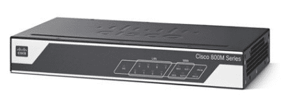

1位 C841M
--------

C841M-4X-JSEC

フラッシュメモリ:2G

メモリ:512MB

WAN(GigaEthernet対応) x2、LAN(GigaEthernet対応) x4

IPsec VPNやSSL VPN、EasyVPNに対応（DMVPNは上位機種のみに対応)

価格帯:10000円～

[Cisco Startシリーズ C841M-4X-JSEC/K9/START ［ギガビット対応VPNルータ（保守2年付）］](https://www.amazon.co.jp/exec/obidos/ASIN/B01BTXG8IO/yonedayuto-22/)

posted with [カエレバ](https://kaereba.com)

Cisco Systems（シスコシステムズ）

[Amazon](https://amzn.to/2P3Cscq)

[楽天市場](https://a.r10.to/hrVSTk)

[Yahooショッピング](//ck.jp.ap.valuecommerce.com/servlet/referral?sid=3352890&pid=885313220&vc_url=https://store.shopping.yahoo.co.jp/fellows-store/y-18042310h.html?sc_i=shp_pc_search_itemlist_shsr_title)

Cisco C841Mという機種が一番おすすめです。理由は**安い**からです。安い上に、CiscoのOSであるIOSが入っていることもあり勉強としても使えるし、普通にルータとしても使えます。C841Mの4X-JSECという型番は上位機種に比べると劣りますが、勉強に使う分や家庭のルータとして使う分には全く問題ないでしょう。また、これはamazonのみの確認となりますが、保守が2年付いているのでもし壊れた時でも安心感があります。（普通に考えると、業務用なので壊れないと思いますが...）DMVPNというようなよくわからない機能を使う場合は上位機種を買ってくださいｗ

Cisco 892
---------

Cisco 892(上)、Cisco892 W(下)

フラッシュメモリ:256MB

メモリ:512MB

WAN(GigaEthernet x1, FastEthernet x1) x2、LAN(FastEthernetのみ) x8、よくわからないポート x1

IPsec VPNやGET VPNやSSL VPNに対応

価格:4000円～

[CISCO892J-K9](https://www.amazon.co.jp/exec/obidos/ASIN/B004HHIYIM/yonedayuto-22/)

posted with [カエレバ](https://kaereba.com)

Cisco Systems

[Amazon](https://amzn.to/2nuWAYr)

[楽天市場](https://a.r10.to/hr4l86)

[Yahooショッピング](//ck.jp.ap.valuecommerce.com/servlet/referral?sid=3352890&pid=885313220&vc_url=http%3A%2F%2Fsearch.shopping.yahoo.co.jp%2Fsearch%3Fp%3DCisco%2520892&vcptn=kaereba)

[CISCO 892W](https://www.amazon.co.jp/exec/obidos/ASIN/B002WD34F6/yonedayuto-22/)

posted with [カエレバ](https://kaereba.com)

Cisco

[Amazon](https://amzn.to/2MDzVny)

[楽天市場](https://a.r10.to/hz3Zub)

[Yahooショッピング](//ck.jp.ap.valuecommerce.com/servlet/referral?sid=3352890&pid=885313220&vc_url=http%3A%2F%2Fsearch.shopping.yahoo.co.jp%2Fsearch%3Fp%3DCisco%2520892%2520W&vcptn=kaereba)

このルータは4000円ぐらいから比較的安く買うことできます。Cisco 892Wの場合だと、無線LANも搭載されているのでAPあたりの設定もできるので勉強するには最適なルータです。また、LANのポートが8ポートもあり、ルーティングやらVLANも割り振りやすいと思います。ルーティングを学ぶのにもおすすめです。オークションなどでも比較的安く手に入れることが出来るのでおすすめの機種です。

Cisco 1700 Series
-----------------

Cisco 1700 Series

フラッシュメモリ:8MB/16MB/32MB/64MB

メモリ:8MB/16MB/32MB/64MB

WAN(FastEthernetのみ) x1

IPsec VPNなど

オプションでシリアルでの通信も可能

[CISCO1712-VPN/K9](https://www.amazon.co.jp/exec/obidos/ASIN/B0000CBJ7H/yonedayuto-22/)

posted with [カエレバ](https://kaereba.com)

CISCO SYSTEMS - ENTERPRISE

[Amazon](https://www.amazon.co.jp/gp/search?keywords=cisco%201700&__mk_ja_JP=%E3%82%AB%E3%82%BF%E3%82%AB%E3%83%8A&tag=yonedayuto-22)

[Yahooショッピング](//ck.jp.ap.valuecommerce.com/servlet/referral?sid=3352890&pid=885313220&vc_url=http%3A%2F%2Fsearch.shopping.yahoo.co.jp%2Fsearch%3Fp%3Dcisco%25201700&vcptn=kaereba)

Cisco 1700 Seriesはルータとしての機能を持っており、オプションボードでシリアルでの通信も可能になっています。正直なところ、かなり古いのでCiscoルータを触り尽くした方が買うのがおすすめです。今はシリアルでの通信など実用的にまったくいらないですが、勉強用としておすすめの機種です。