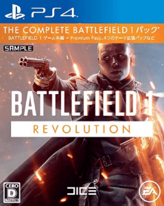

今回は、個人的に買うべきだと思うマルチプレイで楽しめるおすすめのゲームを紹介していきたいと思います。 **注意**:基本的にはPS4の場合はPS4Plus、Xbox Oneの場合はXbox LIVE Goldに加入しないとオンライン対戦ができないので注意してください。 ということで今回はPS4、Xbox Oneで個人的に思うおすすめのマルチプレイゲームを5選に選らんだものを紹介させていただきます。

1.BF1
-----

 販売日:2016年10月21日 マルチプレイ:2人~64人 PlayStation Store:[https://store.playstation.com/ja-jp/product/JP0006-CUSA02400_00-BATTLEFIELD01REV?emcid=EAFranchise2017](https://store.playstation.com/ja-jp/product/JP0006-CUSA02400_00-BATTLEFIELD01REV?emcid=EAFranchise2017) XboxLIVE Store:[https://www.microsoft.com/ja-jp/store/p/-1-Revolution/BPL68T0XK96W](https://www.microsoft.com/ja-jp/store/p/-1-Revolution/BPL68T0XK96W) \[amazonjs asin="B074FX8K4C" locale="JP" title="バトルフィールド 1 Revolution Edition - PS4"\] \[amazonjs asin="B074FX5JHZ" locale="JP" title="バトルフィールド 1 Revolution Edition - XboxOne"\]

[![[商品価格に関しましては、リンクが作成された時点と現時点で情報が変更されている場合がございます。]](https://hbb.afl.rakuten.co.jp/hgb/165de09d.e35b332a.165de09e.a983972a/?me_id=1213310&item_id=18673657&m=https%3A%2F%2Fthumbnail.image.rakuten.co.jp%2F%400_mall%2Fbook%2Fcabinet%2F2615%2F4938833022615.jpg%3F_ex%3D80x80&pc=https%3A%2F%2Fthumbnail.image.rakuten.co.jp%2F%400_mall%2Fbook%2Fcabinet%2F2615%2F4938833022615.jpg%3F_ex%3D128x128&s=128x128&t=picttext "[商品価格に関しましては、リンクが作成された時点と現時点で情報が変更されている場合がございます。]")](https://hb.afl.rakuten.co.jp/hgc/165de09d.e35b332a.165de09e.a983972a/?pc=https%3A%2F%2Fitem.rakuten.co.jp%2Fbook%2F15040214%2F&m=http%3A%2F%2Fm.rakuten.co.jp%2Fbook%2Fi%2F18673657%2F&link_type=picttext&ut=eyJwYWdlIjoiaXRlbSIsInR5cGUiOiJwaWN0dGV4dCIsInNpemUiOiIxMjh4MTI4IiwibmFtIjoxLCJuYW1wIjoiZG93biIsImNvbSI6MSwiY29tcCI6ImRvd24iLCJwcmljZSI6MSwiYm9yIjoxLCJjb2wiOjB9)

[バトルフィールド 1 Revolution Edition　PS4版](https://hb.afl.rakuten.co.jp/hgc/165de09d.e35b332a.165de09e.a983972a/?pc=https%3A%2F%2Fitem.rakuten.co.jp%2Fbook%2F15040214%2F&m=http%3A%2F%2Fm.rakuten.co.jp%2Fbook%2Fi%2F18673657%2F&link_type=picttext&ut=eyJwYWdlIjoiaXRlbSIsInR5cGUiOiJwaWN0dGV4dCIsInNpemUiOiIxMjh4MTI4IiwibmFtIjoxLCJuYW1wIjoiZG93biIsImNvbSI6MSwiY29tcCI6ImRvd24iLCJwcmljZSI6MSwiYm9yIjoxLCJjb2wiOjB9) 価格：5324円（税込、送料無料) (2018/1/28時点)

 

[![[商品価格に関しましては、リンクが作成された時点と現時点で情報が変更されている場合がございます。]](https://hbb.afl.rakuten.co.jp/hgb/165de089.8d049395.165de08a.d226f495/?me_id=1206032&item_id=11827358&m=https%3A%2F%2Fthumbnail.image.rakuten.co.jp%2F%400_mall%2Fjism%2Fcabinet%2F0687%2F4938833022622.jpg%3F_ex%3D80x80&pc=https%3A%2F%2Fthumbnail.image.rakuten.co.jp%2F%400_mall%2Fjism%2Fcabinet%2F0687%2F4938833022622.jpg%3F_ex%3D128x128&s=128x128&t=picttext "[商品価格に関しましては、リンクが作成された時点と現時点で情報が変更されている場合がございます。]")](https://hb.afl.rakuten.co.jp/hgc/165de089.8d049395.165de08a.d226f495/?pc=https%3A%2F%2Fitem.rakuten.co.jp%2Fjism%2F4938833022622-54-29723-n%2F&m=i%2F11827358%2F&link_type=picttext&ut=eyJwYWdlIjoiaXRlbSIsInR5cGUiOiJwaWN0dGV4dCIsInNpemUiOiIxMjh4MTI4IiwibmFtIjoxLCJuYW1wIjoiZG93biIsImNvbSI6MSwiY29tcCI6ImRvd24iLCJwcmljZSI6MSwiYm9yIjoxLCJjb2wiOjB9)

[【Xbox One】バトルフィールド 1 Revolution Edition エレクトロニック・アーツ \[JES1-00464 XboxBF1レボリューションエディ\]【返品種別B】](https://hb.afl.rakuten.co.jp/hgc/165de089.8d049395.165de08a.d226f495/?pc=https%3A%2F%2Fitem.rakuten.co.jp%2Fjism%2F4938833022622-54-29723-n%2F&m=i%2F11827358%2F&link_type=picttext&ut=eyJwYWdlIjoiaXRlbSIsInR5cGUiOiJwaWN0dGV4dCIsInNpemUiOiIxMjh4MTI4IiwibmFtIjoxLCJuYW1wIjoiZG93biIsImNvbSI6MSwiY29tcCI6ImRvd24iLCJwcmljZSI6MSwiYm9yIjoxLCJjb2wiOjB9) 価格：5280円（税込、送料無料) (2018/1/30時点)

 
FPSをやるとしたらまずはこれと言っても過言ではないでしょう。 BF4の次のシリーズとしてBF1がリリースされましたが、マルチプレイで最大64人まで楽しめるというのが一番楽しめる点です！ BF4は舞台は現代でしたが、BF1は第一次世界対戦を舞台にしています。 やはりマップの種類が多く、広いので長く楽しむことができます！！！ また、ストーリーモードがなかなか良いのでマルチしかやらない方でもおすすめです！ バトルフィールドコンパニオンというスマホ向けのアプリを使えば武器などを選ぶこともできるようになっています。 現在はBF4は人口が過疎って来ているので今やるならBF1をおすすめします。

2.Call of Duty WWⅡ
------------------

 販売日:2017年11月3日 マルチプレイ最大人数:18人までかも... PlayStation Store:[https://store.playstation.com/ja-jp/product/JP9201-CUSA08380_00-CODWWIIDELUXEPRE](https://store.playstation.com/ja-jp/product/JP9201-CUSA08380_00-CODWWIIDELUXEPRE) XboxLIVE Store:[https://www.microsoft.com/ja-jp/store/p/call-of-duty-wwii/bv0nsd4nn4v4](https://www.microsoft.com/ja-jp/store/p/call-of-duty-wwii/bv0nsd4nn4v4)   ＊XboxONEのパッケージ版は海外版の販売しかしていないので注意が必要です。 \[amazonjs asin="B07254346J" locale="JP" title="【PS4】コール オブ デューティ ワールドウォーII 【CEROレーティング「Z」】"\] \[amazonjs asin="B072NQJCW5" locale="JP" title="Call of Duty WWII (輸入版:北米) - XboxOne"\]

[![[商品価格に関しましては、リンクが作成された時点と現時点で情報が変更されている場合がございます。]](https://hbb.afl.rakuten.co.jp/hgb/165de09d.e35b332a.165de09e.a983972a/?me_id=1213310&item_id=18582676&m=https%3A%2F%2Fthumbnail.image.rakuten.co.jp%2F%400_mall%2Fbook%2Fcabinet%2F5172%2F4948872015172.jpg%3F_ex%3D80x80&pc=https%3A%2F%2Fthumbnail.image.rakuten.co.jp%2F%400_mall%2Fbook%2Fcabinet%2F5172%2F4948872015172.jpg%3F_ex%3D128x128&s=128x128&t=picttext "[商品価格に関しましては、リンクが作成された時点と現時点で情報が変更されている場合がございます。]")](https://hb.afl.rakuten.co.jp/hgc/165de09d.e35b332a.165de09e.a983972a/?pc=https%3A%2F%2Fitem.rakuten.co.jp%2Fbook%2F14912038%2F&m=http%3A%2F%2Fm.rakuten.co.jp%2Fbook%2Fi%2F18582676%2F&link_type=picttext&ut=eyJwYWdlIjoiaXRlbSIsInR5cGUiOiJwaWN0dGV4dCIsInNpemUiOiIxMjh4MTI4IiwibmFtIjoxLCJuYW1wIjoiZG93biIsImNvbSI6MSwiY29tcCI6ImRvd24iLCJwcmljZSI6MSwiYm9yIjoxLCJjb2wiOjB9)

[コール オブ デューティ ワールドウォーII](https://hb.afl.rakuten.co.jp/hgc/165de09d.e35b332a.165de09e.a983972a/?pc=https%3A%2F%2Fitem.rakuten.co.jp%2Fbook%2F14912038%2F&m=http%3A%2F%2Fm.rakuten.co.jp%2Fbook%2Fi%2F18582676%2F&link_type=picttext&ut=eyJwYWdlIjoiaXRlbSIsInR5cGUiOiJwaWN0dGV4dCIsInNpemUiOiIxMjh4MTI4IiwibmFtIjoxLCJuYW1wIjoiZG93biIsImNvbSI6MSwiY29tcCI6ImRvd24iLCJwcmljZSI6MSwiYm9yIjoxLCJjb2wiOjB9) 価格：7166円（税込、送料無料) (2018/1/30時点)

 

[![[商品価格に関しましては、リンクが作成された時点と現時点で情報が変更されている場合がございます。]](https://hbb.afl.rakuten.co.jp/hgb/165f5ebc.e1ddef57.165f5ebd.71fdf7e8/?me_id=1322355&item_id=10000617&m=https%3A%2F%2Fthumbnail.image.rakuten.co.jp%2F%400_mall%2Fuqvo%2Fcabinet%2Fmem_item%2Fsoft%2Fusaxone%2Fimgrc0073697622.jpg%3F_ex%3D80x80&pc=https%3A%2F%2Fthumbnail.image.rakuten.co.jp%2F%400_mall%2Fuqvo%2Fcabinet%2Fmem_item%2Fsoft%2Fusaxone%2Fimgrc0073697622.jpg%3F_ex%3D128x128&s=128x128&t=picttext "[商品価格に関しましては、リンクが作成された時点と現時点で情報が変更されている場合がございます。]")](https://hb.afl.rakuten.co.jp/hgc/165f5ebc.e1ddef57.165f5ebd.71fdf7e8/?pc=https%3A%2F%2Fitem.rakuten.co.jp%2Fuqvo%2F0047875881129%2F&m=http%3A%2F%2Fm.rakuten.co.jp%2Fuqvo%2Fi%2F10000617%2F&link_type=picttext&ut=eyJwYWdlIjoiaXRlbSIsInR5cGUiOiJwaWN0dGV4dCIsInNpemUiOiIxMjh4MTI4IiwibmFtIjoxLCJuYW1wIjoiZG93biIsImNvbSI6MSwiY29tcCI6ImRvd24iLCJwcmljZSI6MSwiYm9yIjoxLCJjb2wiOjB9)

[XboxONE Call of Duty:WWII USA(コールオブデューティ:WWII 北米版)〈Activision〉11/3発売\[新品\]](https://hb.afl.rakuten.co.jp/hgc/165f5ebc.e1ddef57.165f5ebd.71fdf7e8/?pc=https%3A%2F%2Fitem.rakuten.co.jp%2Fuqvo%2F0047875881129%2F&m=http%3A%2F%2Fm.rakuten.co.jp%2Fuqvo%2Fi%2F10000617%2F&link_type=picttext&ut=eyJwYWdlIjoiaXRlbSIsInR5cGUiOiJwaWN0dGV4dCIsInNpemUiOiIxMjh4MTI4IiwibmFtIjoxLCJuYW1wIjoiZG93biIsImNvbSI6MSwiY29tcCI6ImRvd24iLCJwcmljZSI6MSwiYm9yIjoxLCJjb2wiOjB9) 価格：7880円（税込、送料別) (2018/1/30時点)

 

FPSをやるとしたらこちらのコール オブ デューティシリーズも定番中の定番です。 BF1とは違い第二次世界大戦を舞台にしているゲームです。 マルチプレイでゾンビモードというものもあるのでただ単に戦うだけでは物足りない方でも楽しめるゲームになっています。 BF1のようにデスマッチばっかり飽きてきたという方にはおすすめです！！！

3.モンスターハンター：ワールド
----------------

 販売日2018年1月26日 マルチプレイ最大人数:4人 ＊Xboxでは日本向けに販売していないので無難にPS4版を買った方が良さそうです。（リンクには海外版を張っておきます） PlayStation Store:[https://store.playstation.com/ja-jp/product/JP0102-CUSA06027_00-0000000000000000](https://store.playstation.com/ja-jp/product/JP0102-CUSA06027_00-0000000000000000) XboxLIVE Store:[https://www.microsoft.com/en-us/store/p/monster-hunter-world/bng91pt95lqn?tduid=(51110b2992aae330fe4eb18ca7127358)(256081)(2457211)(C4kK9Npmq74-UiZOMqeI9KlELJShkR9kgw)()](https://www.microsoft.com/en-us/store/p/monster-hunter-world/bng91pt95lqn?tduid=(51110b2992aae330fe4eb18ca7127358)(256081)(2457211)(C4kK9Npmq74-UiZOMqeI9KlELJShkR9kgw)()) \[amazonjs asin="B078ZTD5SV" locale="JP" title="モンスターハンター:ワールド(発売日以降お届け分) - PS4"\] \[amazonjs asin="B071G5JJDW" locale="JP" title="Monster Hunter World (輸入版:北米) - XboxOne"\]

[![[商品価格に関しましては、リンクが作成された時点と現時点で情報が変更されている場合がございます。]](https://hbb.afl.rakuten.co.jp/hgb/165f606c.4b81aeda.165f606d.e433eb2b/?me_id=1297729&item_id=10209378&m=https%3A%2F%2Fthumbnail.image.rakuten.co.jp%2F%400_mall%2Fwondergoo%2Fcabinet%2Fgame6%2F4976219091275.jpg%3F_ex%3D80x80&pc=https%3A%2F%2Fthumbnail.image.rakuten.co.jp%2F%400_mall%2Fwondergoo%2Fcabinet%2Fgame6%2F4976219091275.jpg%3F_ex%3D128x128&s=128x128&t=picttext "[商品価格に関しましては、リンクが作成された時点と現時点で情報が変更されている場合がございます。]")](https://hb.afl.rakuten.co.jp/hgc/165f606c.4b81aeda.165f606d.e433eb2b/?pc=https%3A%2F%2Fitem.rakuten.co.jp%2Fwondergoo%2Fn976219091275%2F&m=http%3A%2F%2Fm.rakuten.co.jp%2Fwondergoo%2Fi%2F10209378%2F&link_type=picttext&ut=eyJwYWdlIjoiaXRlbSIsInR5cGUiOiJwaWN0dGV4dCIsInNpemUiOiIxMjh4MTI4IiwibmFtIjoxLCJuYW1wIjoiZG93biIsImNvbSI6MSwiY29tcCI6ImRvd24iLCJwcmljZSI6MSwiYm9yIjoxLCJjb2wiOjB9)

[【特典付き】モンスターハンター　ワールド＜PS4＞（通常版）20180126](https://hb.afl.rakuten.co.jp/hgc/165f606c.4b81aeda.165f606d.e433eb2b/?pc=https%3A%2F%2Fitem.rakuten.co.jp%2Fwondergoo%2Fn976219091275%2F&m=http%3A%2F%2Fm.rakuten.co.jp%2Fwondergoo%2Fi%2F10209378%2F&link_type=picttext&ut=eyJwYWdlIjoiaXRlbSIsInR5cGUiOiJwaWN0dGV4dCIsInNpemUiOiIxMjh4MTI4IiwibmFtIjoxLCJuYW1wIjoiZG93biIsImNvbSI6MSwiY29tcCI6ImRvd24iLCJwcmljZSI6MSwiYm9yIjoxLCJjb2wiOjB9) 価格：9698円（税込、送料無料) (2018/1/30時点)

 

[![[商品価格に関しましては、リンクが作成された時点と現時点で情報が変更されている場合がございます。]](https://hbb.afl.rakuten.co.jp/hgb/165f5ebc.e1ddef57.165f5ebd.71fdf7e8/?me_id=1322355&item_id=10000654&m=https%3A%2F%2Fthumbnail.image.rakuten.co.jp%2F%400_mall%2Fuqvo%2Fcabinet%2Fmem_item%2Fsoft%2Fusaxone%2Fimgrc0073996648.jpg%3F_ex%3D80x80&pc=https%3A%2F%2Fthumbnail.image.rakuten.co.jp%2F%400_mall%2Fuqvo%2Fcabinet%2Fmem_item%2Fsoft%2Fusaxone%2Fimgrc0073996648.jpg%3F_ex%3D128x128&s=128x128&t=picttext "[商品価格に関しましては、リンクが作成された時点と現時点で情報が変更されている場合がございます。]")](https://hb.afl.rakuten.co.jp/hgc/165f5ebc.e1ddef57.165f5ebd.71fdf7e8/?pc=https%3A%2F%2Fitem.rakuten.co.jp%2Fuqvo%2F0013388550289%2F&m=http%3A%2F%2Fm.rakuten.co.jp%2Fuqvo%2Fi%2F10000654%2F&link_type=picttext&ut=eyJwYWdlIjoiaXRlbSIsInR5cGUiOiJwaWN0dGV4dCIsInNpemUiOiIxMjh4MTI4IiwibmFtIjoxLCJuYW1wIjoiZG93biIsImNvbSI6MSwiY29tcCI6ImRvd24iLCJwcmljZSI6MSwiYm9yIjoxLCJjb2wiOjB9)

[XboxONE Monster Hunter World US(モンスターハンターワールド 北米版)〈Capcom〉1/26発売\[新品\]](https://hb.afl.rakuten.co.jp/hgc/165f5ebc.e1ddef57.165f5ebd.71fdf7e8/?pc=https%3A%2F%2Fitem.rakuten.co.jp%2Fuqvo%2F0013388550289%2F&m=http%3A%2F%2Fm.rakuten.co.jp%2Fuqvo%2Fi%2F10000654%2F&link_type=picttext&ut=eyJwYWdlIjoiaXRlbSIsInR5cGUiOiJwaWN0dGV4dCIsInNpemUiOiIxMjh4MTI4IiwibmFtIjoxLCJuYW1wIjoiZG93biIsImNvbSI6MSwiY29tcCI6ImRvd24iLCJwcmljZSI6MSwiYm9yIjoxLCJjb2wiOjB9) 価格：7880円（税込、送料別) (2018/1/30時点)

 

今月発売されたばかり（執筆時）の話題のソフトです。 筆者もPSPでモンハン3rdやってた頃があったのでリアリティが増してPS4でリリースされたのはとてもうれしく思ってます。 今回はなぜマルチプレイにこれを選んだのかという理由があると思うので説明させていただきます。 かなりの人が買ってるからですｗ FPS系のゲームをやってる人が周りにいなくてもなにかしらこのゲームを買う人は多いと思いますので友達と一緒にボイチャしながらわいわい楽しめるゲームなのでおすすめです。

まとめ
===

こんな感じで紹介させていただきましたがいかがだったでしょうか。 自分が知る限りではこの3つのゲームは知名度MAXなので是非買ってみてください！！！