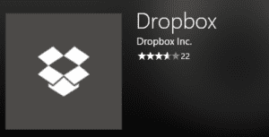

Windows8から新たに今までのソフトとは別のModern UIアプリというものが登場し、windows版のアプリストアもできました。Windows8リリース時の当初のストアアプリは悲惨なぐらいアプリの量が少なかったですが、最近はかなり増えてきました。（と言ってもandroidやiosのアプリストアには全くかないませんが…）ということもあって今回は入れておくと、便利だと個人的に思うWindows10アプリを集めてみました！！

2019/04/17：記事の更新を致しました。

1.テレbing
--------

このアプリはテレビの番組表が見れます。

番組を予約できるわけでもなく確認することしか出ませんが、パソコンで仕事をしている方や普段からパソコンに触れている人にはテレビ番組に触れるいい機会にもなります。

もちろんキーワード検索やジャンル検索ぐらいしかできません。でも、それがいいんです。逆にこのようなシンプルなアプリで手軽に見れるという点で選びました。

わざわざテレビの番組表をみるのがめんどくさいという方にはおすすめです。

[テレbing（ストアページ）](https://www.microsoft.com/ja-jp/store/p/%E3%83%86%E3%83%ACbing/9wzdncrfjbc6)

アプリがなくなっていました。

1.Slack
-------

大学やIT業界でよく使われるコミュニケーションツールです。

デスクトップ版のアプリなどもありますが、ストア版の方がアップデートが楽なのでおすすめです。

デスクトップ版との差異も見当たらないので、インストールしようとしている方にはかなりおすすめです。

[https://www.microsoft.com/ja-jp/p/slack/9wzdncrdk3wp?activetab=pivot%3Aoverviewtab](https://www.microsoft.com/ja-jp/p/slack/9wzdncrdk3wp?activetab=pivot%3Aoverviewtab)Slack(ストアページ)

2.ACGプレイヤー
----------

形式はどれほど対応しているかわかりませんが（説明文に一切説明がない）、windowsストアアプリのメディアプレイヤーの中では一番使いやすく軽いです。

VLCのストアアプリ版と思っていただけたらわかると思います。実はVLCもストアアプリにありますが、こちらの環境ではACGプレイヤーの方が安定して再生したのでこちらを選びました。

ACGプレイヤーの軽量版としてAx-Lite プレイヤーもあります。低スペックなタブレットPCなどに使う場合はAx-Lite プレイヤーがぴったりだと思います。

[ACGプレイヤー（ストアページ）](https://www.microsoft.com/ja-jp/store/p/acg-%E3%83%97%E3%83%AC%E3%82%A4%E3%83%A4%E3%83%BC/9nblggh698c7#)

[Ax-Liteプレイヤー（ストアページ）](https://www.microsoft.com/ja-jp/store/p/ax-lite-%E3%83%97%E3%83%AC%E3%82%A4%E3%83%A4%E3%83%BC/9nblggh68jgp)

3.LINE
------

ストアアプリ版とデスクトップ版の違いはUIがタブレットに向いていることです。

タブレットでLINEのデスクトップ版を開くと案外メモリなどが占領されて端末が熱くなることがよくあります。しかし、ストアアプリ版だとかなり軽く動いてくれます。

1~2年前にはバーコードによるログイン（端末のLINEを一時的に同期させる機能）ができませんでしたが、つい最近やっと対応したおかげでかなり使いやすくなりました。

デスクトップ版と違って、アプリ単体でスクリーンショットを撮れなくなりますがメッセージを見るには十分だと思います。

[LINE（ストアページ）](https://www.microsoft.com/ja-jp/store/p/line/9wzdncrfj2g6)

4.Dropbox
---------

フォルダを同期まではしないけど、保存したものを見たい！！という方にお勧めです。

デスクトップ版のdropboxは同期するときにCPUなどの使用率があがって、困っているという方たくさんおられるはずです。

そこで、このアプリがおすすめです。

アプリでのフォルダの同期はできないもののファイルなどのアップロードは手動でできるので、めちゃくちゃおすすめです。

同期系のソフトは便利だけどそのせいでパソコンが重い方はこちらに移行しましょう。

[Dropbox（ストアページ）](https://www.microsoft.com/ja-jp/store/p/dropbox/9wzdncrfj0pk)

まとめ
===

ストアアプリを4つ紹介させていただきました。

冒頭でも言ったようにwindowsストアのアプリは徐々に増えてきてはいますが、やはりandroidやiosには叶いません。

もっと増えてきてほしいなあと思うところです。bash on ubuntu on windowsでwindowsでubuntuが動くようになりました。

次回は有料アプリの紹介をさせていただきます。