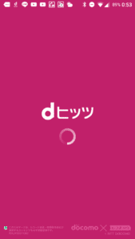

1.amazonプライム会員
--------------

 公式サイト：[https://www.amazon.co.jp/gp/prime](https://www.amazon.co.jp/gp/prime) 年間:3900円（月額換算:325円） 契約方法:クレジットカード（デビットカードも可能）のみ よい点

*   配送無料
*   お急ぎ便無料
*   プライムミュージック
*   プライムビデオなど

悪い点

*   特にないが、契約の際はクレジットカードが必要

サービスの詳細は前に記事にしているので[こちら](http://yoneyannet.com/amazon%E3%83%97%E3%83%A9%E3%82%A4%E3%83%A0%E3%81%AE%E3%83%A1%E3%83%AA%E3%83%83%E3%83%88/)を見ていただけるとわかると思います。 一番おすすめの有料サービスです。 この価格帯で豊富なサービスがあるので絶対契約しておいた方がいいです。

2.dヒッツ
------

 公式サイト：[https://selection.music.dmkt-sp.jp/](https://selection.music.dmkt-sp.jp/) 月額500円(税抜） 契約方法:クレジットカード（デビットカードも可能）のみ 対応OS:android、ios よい点

*   日本の曲が多い
*   アニソンも比較的多い

悪い点

*   スマホにキャッシュできる曲が一か月につき10曲ずつしか登録できないので注意！！
*   モバイルOSにしか対応していないのでパソコンなどで聞くことができない。

しかし、一か月に10曲しか聞けないというわけでもなく、dヒッツ内でプレイリストが作られている曲はストリーミングでの再生ができます。 dヒッツは他の聴き放題サービスと比べてアニソンやJ-POPも多いのでおすすめです。

3.カラオケ＠DAM
----------

 公式サイト：[http://www.clubdam.com/app/karaokeAtDam/](http://www.clubdam.com/app/karaokeAtDam/?this_display_date=2017-01-25&last_display_date=2017-01-18) 月額1080円（yahooプライム＋yahooウォレット払いで216円割引） 契約方法:クレジットカード（デビットカードも不可）、yahooウォレット、携帯払い 対応OS:PS4、XboxONE、Windows10 よい点

*   家でカラオケが楽しめる
*   ほとんどの据え置きデバイスに対応している
*   精密採点相当の採点機能ができる

悪い点

*   採点機能は精密採点のみ

[こちら](http://yoneyannet.com/%e5%ae%b6%e3%81%a7%e3%82%ab%e3%83%a9%e3%82%aa%e3%82%b1%e3%82%92%e6%a5%bd%e3%81%97%e3%82%80%ef%bc%88%e3%82%ab%e3%83%a9%e3%82%aa%e3%82%b1dam-for-windows10%ef%bc%89/)にカラオケ＠DAMの詳しいレビューなどをしたので見て頂けるとわかると思います。 デビットカードでの決済はできませんが、yahooウォレット経由で支払うと、デビットカードでも支払いが可能になります。 カラオケがパソコンではなくゲーム機でもできるようになっているので導入しやすいと思います。 これを契約すると、正直カラオケ屋に行く必要があまりなくなりましたｗｗｗ とはいっても採点機能がなどがLIVEDAMよりも少ないという点は注意してください。

４.ニコニコ動画
--------

 公式サイト：[https://secure.nicovideo.jp/secure/premium_detail](https://secure.nicovideo.jp/secure/premium_detail) 月額:540円 契約方法:クレジットカード、webmoney、ケータイ払い、APPLEIDなど よい点

*   プレミアム専用回線
*   低画質モード回避
*   ニコ割、広告を非表示にできる
*   マイリスト、マイメモリなどの登録数が増える
*   生放送の優先視聴
*   生放送の配信など
*   支払方法が多種多様にある。

悪い点

*   値段が少し高い。個人的には月額300円ぐらいに抑えてほしいところ

生放送が終わってからでもタイムシフトで見ることができます。一般会員の場合、事前にタイムシフト予約する必要がありますが、プレミアム会員になると生放送が終わってからでも予約することができます。 プレミアム会員の特典は公式サイトから詳しく見ることができます。 支払方法がたくさんあります。詳細は[http://qa.nicovideo.jp/faq/show/829](http://qa.nicovideo.jp/faq/show/829)を。 ニコ動はアニメの一挙放送がかなりあるので、アニメ好きにはおすすめです。

５.Yahoo!プライム
------------

 公式サイト：[http://premium.yahoo.co.jp/](http://premium.yahoo.co.jp/) 月額:498円 契約方法:クレジットカード、口座振替 よい点

*   漫画がごく一部無料で読める
*   Tポイントくじ
*   各種割引（大量にある）
*   yahooスマホバックアップの容量50GB
*   メールボックス容量無制限

悪い点

*   コンビニなどでTポイントを使わない場合は正直あまり契約する必要性がない
*   各種割引（ポケットWIFIなどのサービス）を使わない場合も契約する必要性があまりない
*   googleなどの他サービスでメールを管理している場合は契約する必要性がない。

個人的にはカラオケ＠DAMがyahooプレミアムになると216円引きになるのでそのついでに契約したというのが本音です。 しかし、コンビニでよくTポイントを使うので、yahooプレミアムでくじにあったポイントをそこで使えたりするので、気に入っています。